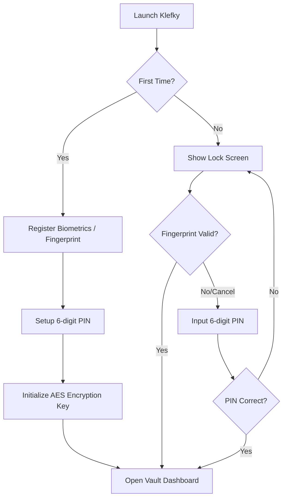

# Klefky: Secure Offline Password Vault & Manager
## Product & Architectural Summary

This document summarizes the proposed product concept, visual theme, user experience flow, and technical architecture for the **Klefky** password manager application.

---

## 🛡️ Core App Concept
**Klefky** is a high-security, local-first offline password manager built with **Expo (React Native) and TypeScript**. It keeps all sensitive credentials encrypted directly on the user's device, ensuring absolute privacy (zero-knowledge architecture) with biometric locks and a 6-digit backup PIN.

---

## 🔒 Authentication & Lock Flow

When the app is opened, it strictly checks the registration status:

1. **Fingerprint Registration:** Leveraging native local authentication (`expo-local-authentication`), the user registers their fingerprint/biometrics.
2. **PIN Code Setup:** A custom, elegant 6-digit numpad screen prompt to establish a backup PIN.
3. **Vault Lockdown:** The app intercepts every launch with a biometric prompt, falling back immediately to the PIN keypad if requested.

---

## 🧭 Navigation Layout & Bottom Navigation Modules

The app will feature a sleek **Bottom Navigation Bar** composed of four essential modules:

| Tab Module | Core Features | Visual Highlights |
| :--- | :--- | :--- |
| **🔐 Vault (Home)** | • Search credentials • Grid of popular apps (Steam, Netflix, Google, Spotify, etc.) • Category sorting (Social, Finance, Work) • Add/Edit screen | • Branded app cards with official colors • Quick-copy buttons with tap haptics • Floating addition button |
| **⚡ Generator** | • Customizable length slider (8 to 64 chars) • Toggle parameters (Symbols, Numbers, Caps) • History log of generated keys | • Live password strength progress bar • One-tap copy & secure clipboard wipe |
| **📊 Security (Dashboard)** | • Audit metrics of saved entries • Leak checks (mock/local dictionary check) • Reused password detection | • Glowing security rings (score percentage) • List of accounts needing attention |
| **⚙️ Settings** | • Toggle Biometric login • Change 6-digit PIN • Self-Destruct trigger (wipe on X failed PIN attempts) • Encrypted backup/restore (JSON import/export) | • Clean modern settings list • Danger zone options in red glassmorphism |

---

## 🛠️ Tech Stack & Security Architecture

1. **Client Framework:** Expo SDK 56 + React Native (with TypeScript) using a clean, custom design system.
2. **Device Biometrics:** `expo-local-authentication` to communicate with native FaceID / TouchID / Android Fingerprint services.
3. **Secure Vault Storage:**
   * **Keys:** `expo-secure-store` to keep the master encryption key, biometric preferences, and hashed PIN.
   * **Data Vault:** `expo-file-system` to write/read the database. The database is stored as a JSON file encrypted using **AES-256** via `crypto-js` so that even if the device is rooted or compromised, the vault file remains unreadable without the master key.
4. **Navigation Framework:** React Navigation (or Expo Router) with dynamic authentication state switches.

---

## 🎨 Recommended Visual Theme: "Midnight Obsidian"

A premium dark theme designed to inspire trust and visual excellence:
* **Background:** Dark slate & deep obsidian (`#0F172A`, `#020617`).
* **Accents:** Glowing neon security blue (`#38BDF8`) and matrix green (`#10B981`) for successful indicators.
* **Component Styling:** Glassmorphic translucent cards, elegant shadows, and smooth micro-animations on touch press.
